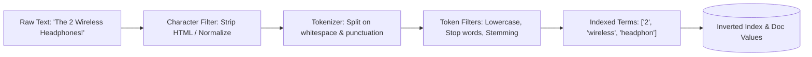
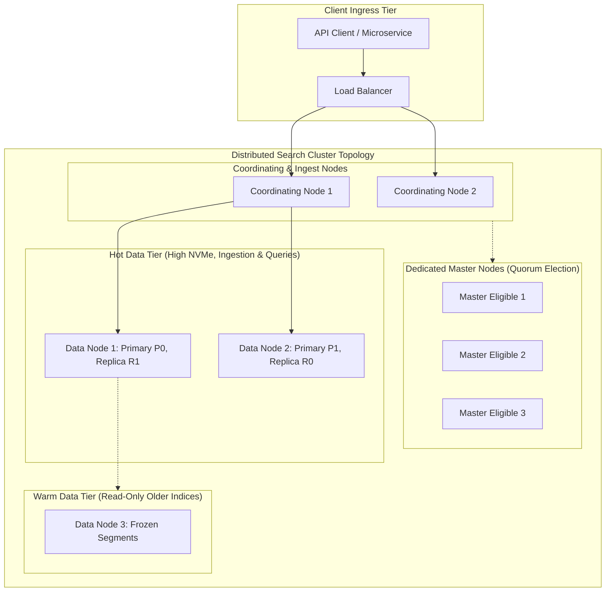
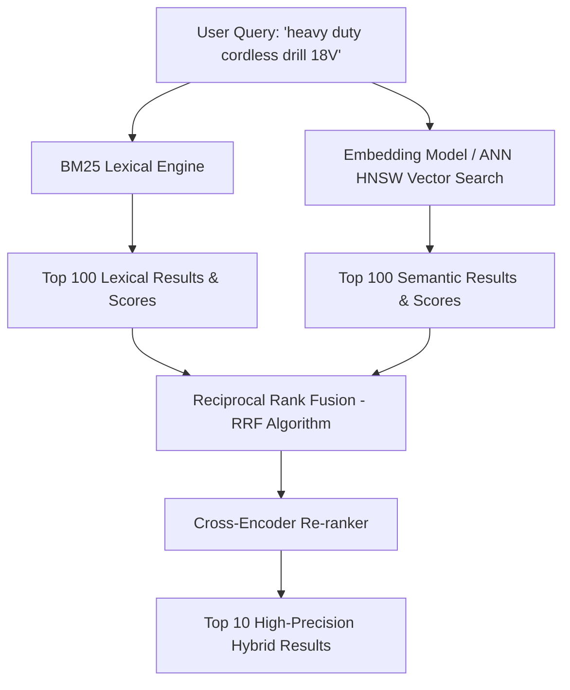

# Enterprise Search Architecture: Inverted Indexes, BM25, and Hybrid Vector Search

## 1. Architectural Overview & Context
Enterprise search engines (Elasticsearch, OpenSearch, Solr) are distributed, document-oriented analytical databases optimized for ultra-fast full-text search, multi-faceted filtering, and relevance ranking across millions of unstructured or semi-structured documents.

Relational databases use B-Trees optimized for exact match lookups (`WHERE id = 'X'`). Querying freeform text with SQL (`WHERE description LIKE '%wireless headphones%'`) forces a catastrophic, full-table disk scan that completely collapses at scale. Search engines solve this via the **Inverted Index**.

```
┌───────────────────────────────────────┐         ┌───────────────────────────────────────┐
│        RELATIONAL B-TREE INDEX        │         │            INVERTED INDEX             │
├───────────────────────────────────────┤         ├───────────────────────────────────────┤
│ Record ID ──► Row Content             │         │ Term (Token) ──► Posting List [DocIDs]│
│ [Doc 1]: "Wireless noise headphones"  │  ──►───►│ "wireless"   ──► [Doc 1, Doc 3]       │
│ [Doc 2]: "Wired studio headphones"    │         │ "headphones" ──► [Doc 1, Doc 2, Doc 3]│
│ [Doc 3]: "Bluetooth wireless speaker" │         │ "studio"     ──► [Doc 2]              │
└───────────────────────────────────────┘         └───────────────────────────────────────┘
```

---

## 2. Inverted Index Mechanics & Analysis Pipeline

When a document is indexed, it passes through an **Analyzer Pipeline** before hitting the disk:



### Lucene Immutability & Segment Merges
Inverted indexes are written as **immutable disk segments**. 
* Documents cannot be updated in-place; updates create a new document in a new segment while marking the old document as deleted.
* Background workers continuously execute **Segment Merges** to consolidate smaller segments and permanently purge deleted documents.

---

## 3. Relevance Scoring: Okapi BM25 Formulation

Modern search engines rank documents using the **Okapi BM25** probabilistic scoring algorithm:

$$\text{Score}(D, Q) = \sum_{i=1}^{N} \text{IDF}(q_i) \cdot \frac{f(q_i, D) \cdot (k_1 + 1)}{f(q_i, D) + k_1 \cdot \left(1 - b + b \cdot \frac{|D|}{\text{avgdl}}\right)}$$

Where:
* **$\text{IDF}(q_i)$ (Inverse Document Frequency)**: Rare words across the corpus (e.g. "Spondylitis") contribute much higher weight than common words (e.g. "wireless").
* **$f(q_i, D)$ (Term Frequency)**: How many times term $q_i$ appears in document $D$.
* **$k_1$ (Saturation Parameter)**: Prevents term repetition from overwhelming the score (default: $1.2$).
* **$b$ (Length Normalization)**: Penalizes excessively long documents (default: $0.75$).

---

## 4. OpenSearch / Elasticsearch Cluster Architecture



---

## 5. Modern Standard: Hybrid Search (BM25 + Vector Embeddings)

Traditional keyword search fails when users search with synonyms or conceptual queries ("portable sound device" does not match "wireless bluetooth speaker"). Vector search solves semantic understanding, but fails at exact keyword matches (part numbers, serial codes).

**Hybrid Search** combines the best of both worlds:



### Reciprocal Rank Fusion (RRF) Formula:
$$\text{RRF\_Score}(d) = \sum_{m \in M} \frac{1}{k + r_m(d)}$$
Where $r_m(d)$ is the rank of document $d$ in retrieval system $m$, and $k$ is a smoothing constant (typically $60$).

---

## 6. Enterprise Search Architectural Checklist
- [ ] Maintain dedicated master-eligible nodes (minimum 3) isolated from heavy data indexing workloads.
- [ ] Size primary shards so that individual shard size remains within the optimal **$20\text{GB} - 50\text{GB}$** window.
- [ ] Enforce Index Lifecycle Management (ILM) to roll hot indices to warm/cold tiers automatically.
- [ ] Adopt Hybrid Search (BM25 + HNSW Vector Search) for AI RAG and modern e-commerce catalogs.
- [ ] Disable dynamic mapping in production (`dynamic: strict`) to prevent mapping explosions that crash cluster state.
- [ ] Route multi-entity join queries through parent-child joins or denormalize documents at index time.

---

## 7. Related Modules
* [01-architecture/ai-architecture/](../../01-architecture/ai-architecture/README.md) — RAG retrieval pipelines, chunking, and embedding models.
* [06-data/caching/](../caching/README.md) — Query caching and stampede prevention.
* [12-ai/model-serving/](../../12-ai/model-serving/README.md) — Embedding generation and inference latency budgets.
