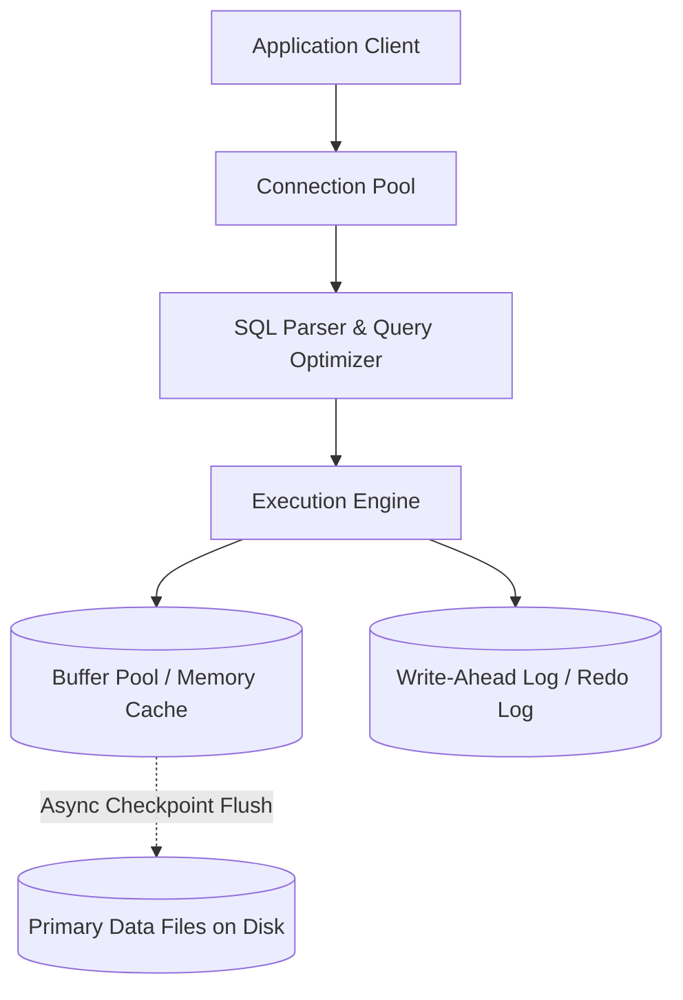

# SQL Architecture: Query Optimization & Execution Plan Analysis

## 1. Architectural Purpose & Problem Context
Cost-based optimizers (CBO), index seeks vs table scans, nested loop vs hash joins, statistics freshness, and diagnosing query plan regressions.

---

## 2. Structural Architecture & Engine Mechanics

---

## 3. Production Invariants & Best Practices
- Every production table must have an explicit primary key.
- Never execute DDL migrations that acquire exclusive table locks during peak production traffic; use the Expand/Contract pattern.
- Always monitor replication lag when routing read queries to secondary replicas.
- Size database connection pools conservatively; oversized pools degrade database throughput due to CPU context switching.
