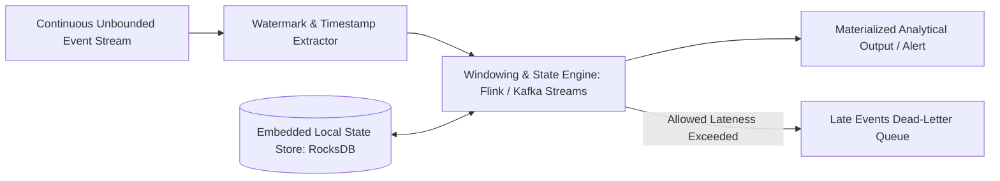

# Data Streaming: Stream Retention, Compaction & Historical Replayability

## 1. Architectural Purpose & Problem Context
Time-based and size-based log retention, log compaction for changelogs, and deterministic historical state reconstruction via replay.

---

## 2. Stream Processing Architecture & Windowing Topology

---

## 3. Production Invariants
- Always use Event Time with realistic watermarking for financial, billing, and analytical computations.
- Ensure stateful stream processing checkpoints are saved to highly durable cloud object storage (S3/GCS).
- Design stream consumers to be idempotent; network rebalances will cause redeliveries of uncommitted batches.
