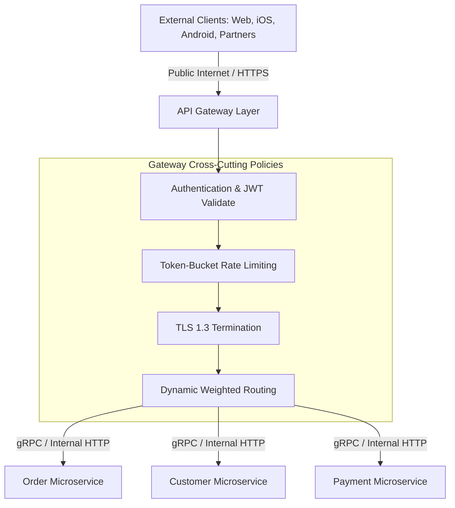

# API Gateway Architecture & Patterns

## 1. Overview & Architectural Role
The API Gateway is the single point of ingress and policy enforcement sitting between external clients (web, mobile, IoT, third-party partners) and internal microservice clusters. It encapsulates system architecture, shields internal network topologies, and centralizes cross-cutting concerns (authentication, TLS termination, rate limiting, and observability).

---

## 2. Directory Structure
* [API Gateway Pattern](api-gateway-pattern.md)
* [Reverse Proxy Architecture](reverse-proxy.md)
* [Dynamic Routing & Traffic Splitting](routing.md)
* [Edge Authentication (JWT & OAuth2)](authentication.md)
* [Edge Authorization & Policy Enforcement (OPA)](authorization.md)
* [Distributed Rate Limiting](rate-limiting.md)
* [Request Transformation & gRPC Transcoding](request-transformation.md)
* [SSL/TLS Termination](ssl-termination.md)
* [Backend-for-Frontend (BFF) Pattern](bff-pattern.md)
* [Envoy vs. Kong vs. AWS API Gateway](envoy-vs-kong-vs-api-gateway.md)
