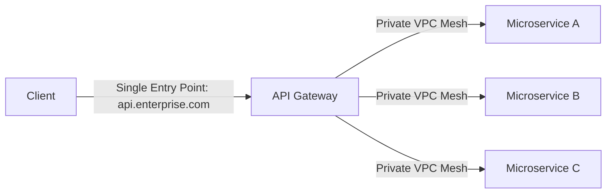

# The API Gateway Pattern

## 1. Problem Solved
Without an API Gateway:
* Clients must maintain connections and track IP addresses for dozens of microservices.
* Cross-cutting logic (JWT verification, CORS, rate limiting, logging) must be re-implemented in every single service and programming language.
* Refactoring or splitting microservices breaks external client contracts.

---

## 2. Core Capabilities
1. **Request Routing**: Directs requests based on path, hostname, or headers.
2. **API Composition**: Aggregates responses from multiple microservices into a single unified JSON response.
3. **Protocol Transcoding**: Translates external REST/JSON into high-speed internal gRPC.
4. **Security Perimeter**: Terminates public TLS; blocks malicious SQLi/XSS at the WAF edge.
