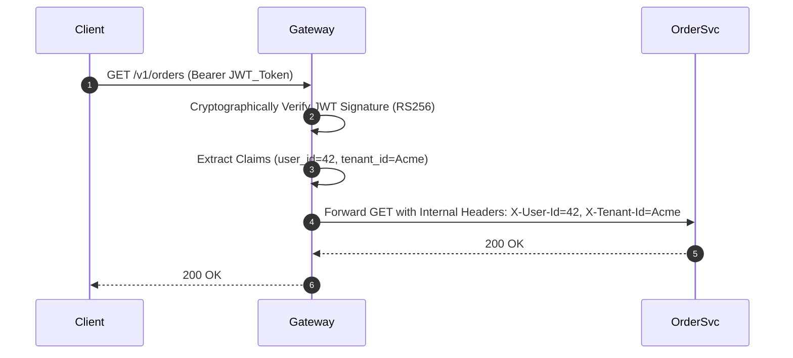

# Edge Authentication Architecture

## 1. Offloading Authentication to the Gateway
Individual microservices should never handle raw password hashing or public OAuth token verification. The API Gateway authenticates the client at the edge perimeter.

---

## 2. Mutual TLS (mTLS) for Zero Trust
While external traffic authenticates via JWT/OAuth2, internal communication between the API Gateway and backend microservices is secured via **mTLS (Mutual TLS)** using a service mesh (Istio / Linkerd), ensuring cryptographic identity verification for every packet.
