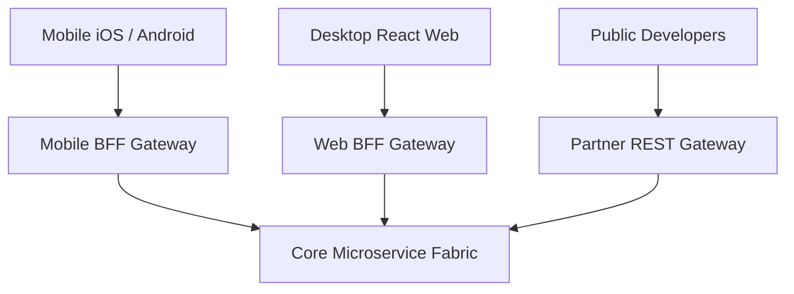

# Backend-for-Frontend (BFF) Pattern

## 1. The Multi-Client Divergence
Different client form-factors have radically conflicting requirements:
* **Mobile Apps**: High-latency cellular links; requires small payloads, coarse-grained aggregations, and battery preservation.
* **Desktop Web**: High-bandwidth fiber; rich multi-column dashboards.
* **Third-Party Partners**: Strict OpenAPI REST stability.

---

## 2. Architectural Benefits
* Teams own both their frontend and their dedicated BFF, eliminating cross-team feature release bottlenecks.
* Each BFF optimizes payload size, aggregation, and caching specific to its target client device.
