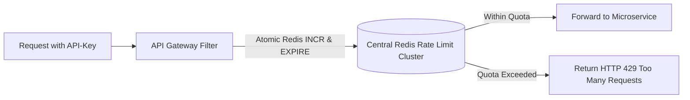

# Distributed Rate Limiting at the Gateway

## 1. Rate Limiting Scopes
1. **Global Gateway Quota**: Protects total cluster capacity (e.g., max 100,000 RPS across all callers).
2. **Per-IP Rate Limiting**: Shields against unauthenticated volumetric DDoS attacks.
3. **Per-Tenant / Per-User Quota**: Enforces API subscription tiers (e.g., Free Tier = 100 req/min; Enterprise = 10,000 req/min).

