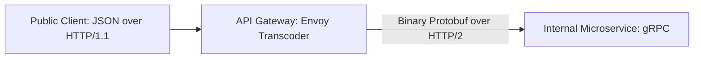

# Request Transformation & gRPC Transcoding

## 1. Capabilities
* **Header Enrichment**: Gateway strips untrusted external headers and injects verified context: `X-User-Id`, `X-Tenant-Id`, `X-Trace-Id`.
* **Payload Normalization**: Sanitizes input fields and strips blacklisted parameters.
* **REST-to-gRPC Transcoding (Envoy / gRPC-Gateway)**: Translates external HTTP/1.1 JSON into internal HTTP/2 Protocol Buffers, providing microsecond internal communication while maintaining public REST compatibility.

