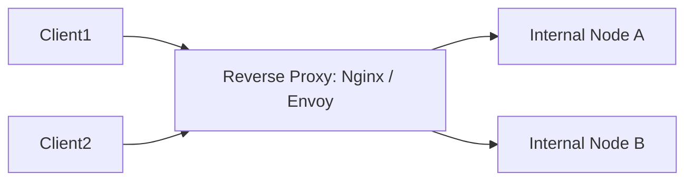

# Reverse Proxy Architecture

## 1. Forward vs. Reverse Proxy
* **Forward Proxy**: Sits in front of a client (e.g., corporate VPN); hides the client identity from destination servers.
* **Reverse Proxy**: Sits in front of backend servers; hides backend cluster topology from external clients.

---

## 2. Architectural Functions
* **Connection Multiplexing**: Manages 100,000 slow client TCP sockets at the edge, maintaining a persistent pool of fast keep-alive TCP connections to internal backend nodes.
* **Buffer Management**: Buffers slow client uploads in RAM, releasing payloads to internal services at wire speed to prevent thread starvation.
