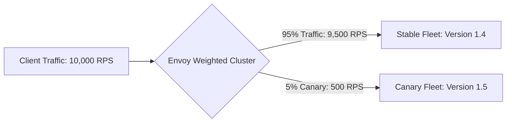

# Dynamic Routing & Traffic Splitting

## 1. Routing Modalities
* **Path-Based Routing**:
  * `/v1/orders/*` $\rightarrow$ Order Service Fleet
  * `/v1/users/*` $\rightarrow$ User Service Fleet
* **Host / SNI Routing**:
  * `api.enterprise.com` $\rightarrow$ Public API Gateway
  * `admin.enterprise.com` $\rightarrow$ Internal Admin Gateway

---

## 2. Canary Traffic Splitting (Weighted Routing)
API gateways facilitate zero-downtime canary deployments by dynamically partitioning traffic based on percentage weights:

