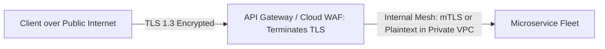

# SSL/TLS Termination Architecture

## 1. Edge TLS Offloading
Asymmetric public-key cryptography during TLS 1.3 handshakes consumes substantial CPU resources. Terminating TLS at the API Gateway or Edge Load Balancer offloads cryptographic load from application servers.

---

## 2. Automated Certificate Lifecycle
* Automated certificate issuance and renewal via **ACME protocol** (Let's Encrypt / HashiCorp Vault / AWS Certificate Manager).
* Zero-downtime certificate rotation without gateway restarts.
