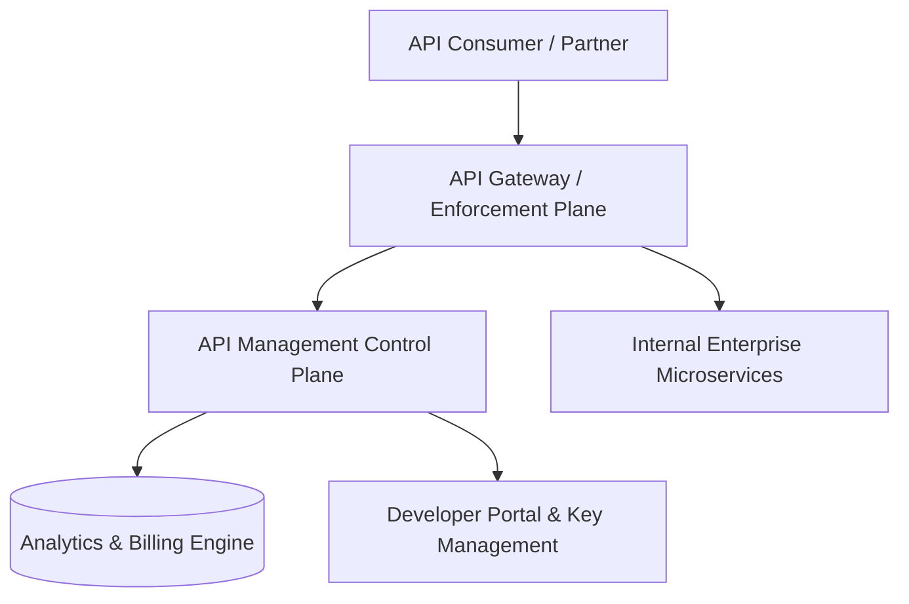

# API Management: API Analytics, SLA Observability & Monetization

## 1. Architectural Purpose & Problem Context
Tracking usage metrics: latency percentiles, error rates by consumer, billing usage meters, and API deprecation compliance.

---

## 2. API Management Topology

---

## 3. Production Invariants
- Never expose internal service APIs directly to external consumers without passing through API Management governance.
- Always communicate rate limit quotas via standard HTTP headers (`RateLimit-Limit`, `RateLimit-Remaining`, `RateLimit-Reset`).
