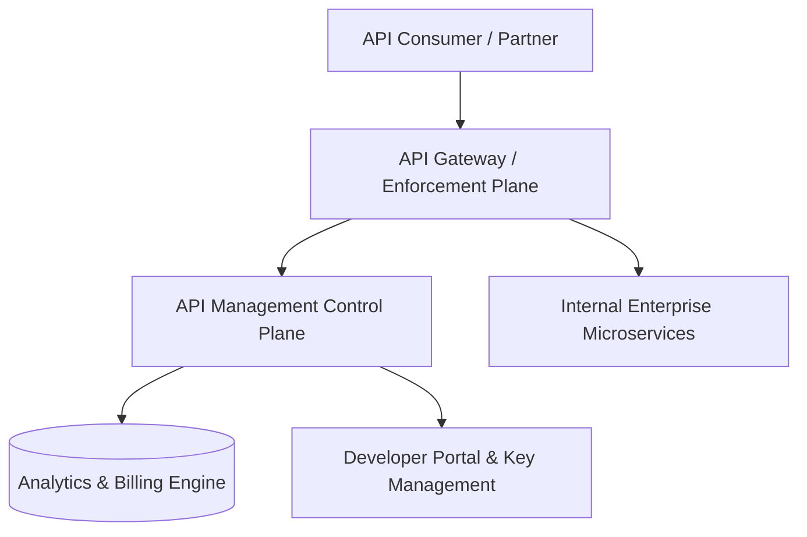

# API Management: API Publishing, Documentation & Developer Portals

## 1. Architectural Purpose & Problem Context
Self-service onboarding, interactive API playgrounds, OpenAPI spec synchronization, and role-based documentation visibility.

---

## 2. API Management Topology

---

## 3. Production Invariants
- Never expose internal service APIs directly to external consumers without passing through API Management governance.
- Always communicate rate limit quotas via standard HTTP headers (`RateLimit-Limit`, `RateLimit-Remaining`, `RateLimit-Reset`).
