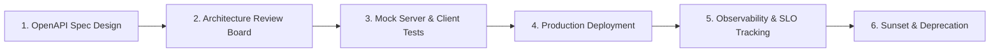

# API Architecture: Enterprise API Lifecycle Governance

## 1. Architectural Purpose & Problem Context
Managing API progression: Design -> Review (ARB) -> Staging -> Active Production -> Deprecated -> Sunset with clear phase gates.

---

## 2. API Governance Lifecycle

---

## 3. Production Invariants
- All public and internal inter-service APIs must maintain an up-to-date, machine-readable OpenAPI specification.
- Never introduce breaking changes (e.g., removing fields, changing types) in minor API releases; maintain a minimum 12-month deprecation window.
