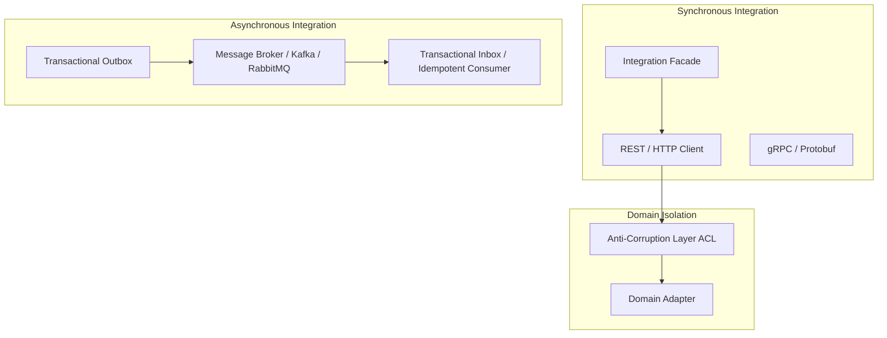

# Application Integration Architecture

Application integration patterns dictate how software boundaries interact reliably, securely, and evolvably across disparate sub-systems, services, and legacy platforms.

---

## Architectural Taxonomy

---

## Knowledge Index
- [Service Client Pattern](service-client-pattern.md)
- [API Client Pattern](api-client-pattern.md)
- [Adapter Pattern](adapter-pattern.md)
- [Facade Pattern](facade-pattern.md)
- [Anti-Corruption Layer (ACL)](anti-corruption-layer.md)
- [Integration Service Pattern](integration-service.md)
- [Transactional Outbox Pattern](transactional-outbox.md)
- [Transactional Inbox Pattern](inbox-pattern.md)
- [Idempotent Consumer Pattern](idempotent-consumer.md)
- [Synchronous Integration Architecture](synchronous-integration.md)
- [Asynchronous Integration Architecture](asynchronous-integration.md)
