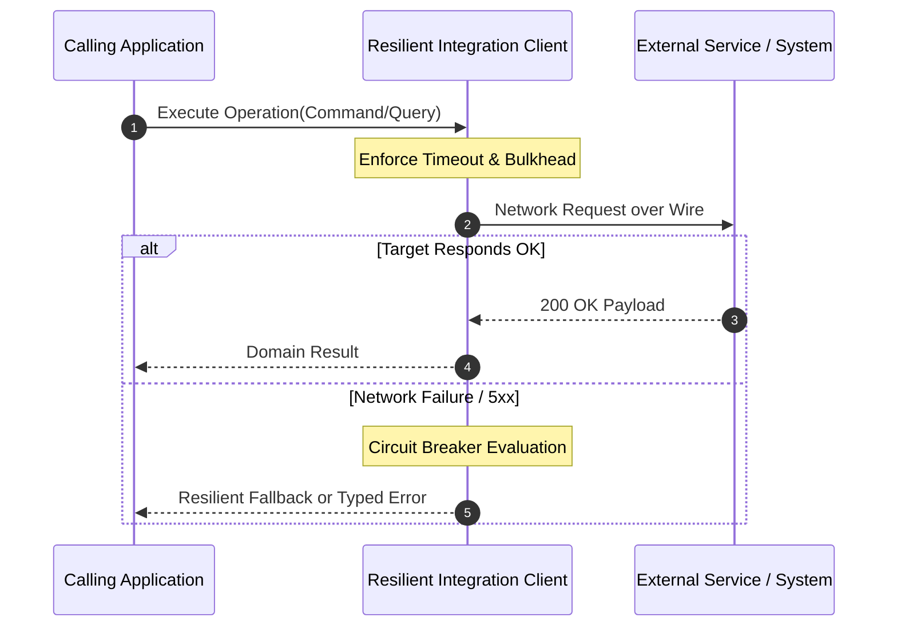

# Integration Architecture: Transactional Inbox Pattern

## 1. Architectural Purpose & Problem Context
Deduplicating incoming integration events by recording processed message IDs within the local transaction boundary.

---

## 2. Structural Interaction Flow

---

## 3. Production Invariants & Enterprise Rules
- Never expose external schemas directly into internal core domain models; always translate via an Anti-Corruption Layer (ACL).
- All synchronous outbound HTTP/RPC calls must enforce mandatory connection timeouts, read timeouts, and circuit breakers.
- For asynchronous updates requiring database consistency, always use the Transactional Outbox Pattern to avoid dual-write race conditions.
