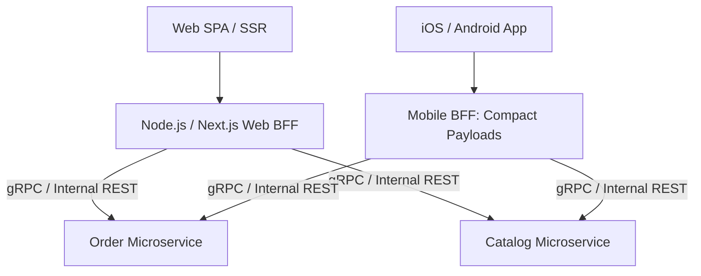

# BFF Architecture: BFF vs Centralized API Gateway: Architectural Boundaries

## 1. Architectural Purpose & Problem Context
Disambiguating roles: API Gateways handle platform routing and rate-limiting; BFFs handle domain data reshaping and client session aggregation.

---

## 2. BFF Architecture Blueprint

---

## 3. Production Invariants
- BFFs must be owned by the corresponding frontend application engineering squads.
- BFFs must not contain core business logic or directly mutate database schemas; they are aggregation and transformation layers.
