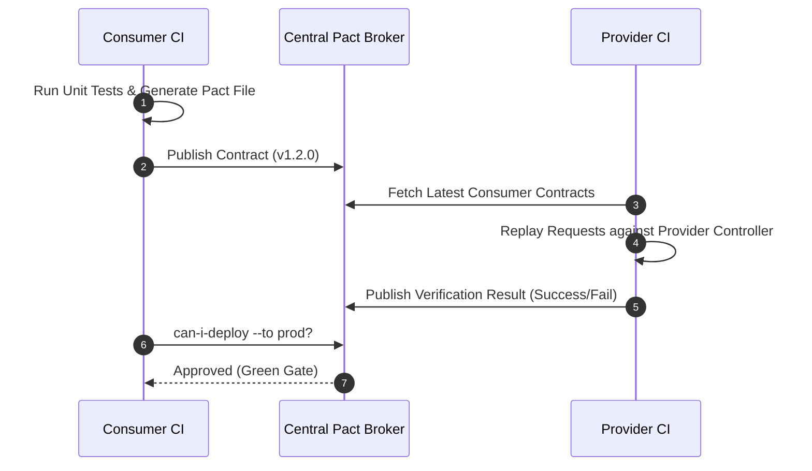

# Contract Testing: Schema Validation vs Contract Testing

## 1. Architectural Purpose & Problem Context
Why static schema validation (JSON Schema/Protobuf) ensures syntax, while contract testing ensures behavioral compatibility.

---

## 2. Structural Workflow & Broker Topology

---

## 3. Production Invariants
- Enforce the **Tolerant Reader Pattern**: Consumers should only validate fields they explicitly consume, ignoring unexpected fields.
- Never deploy a breaking schema change without verifying all consumer contracts via the Pact Broker.
