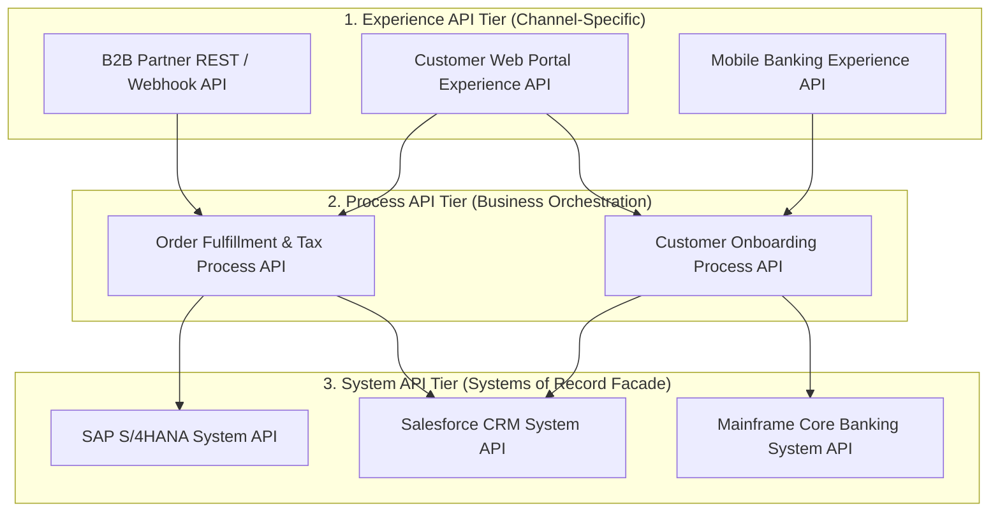

# Enterprise Integration Architecture: Topologies, API-Led Connectivity, and Middleware Evolution

## 1. Architectural Overview & Context
**Enterprise Application Integration (EAI)** addresses the challenge of orchestrating communication across disparate, heterogeneous platforms within an enterprise—including SaaS applications, cloud microservices, legacy on-premises databases, and operational data hubs.

### Ownership Boundary Declaration:
* **This Module ([`07-integration/enterprise-integration/`](README.md))**: Defines **generic enterprise integration topologies**, middleware patterns (ESB vs iPaaS vs Event Mesh), API-Led Connectivity (MuleSoft three-tier API architecture), and canonical enterprise data models.
* **[`14-enterprise-integration/`](../../14-enterprise-integration/)**: Contains **deep industry-vertical integration implementations** (Banking ISO 20022, Healthcare FHIR/HL7, Payment Gateways/PCI-DSS, SAP S/4HANA OData/IDocs, Salesforce CDC/Bulk v2, and financial break reconciliation).

---

## 2. Evolution of Enterprise Integration Topologies

```
1. Point-to-Point (Spaghetti)         2. Centralized Hub (ESB)            3. Modern Distributed Event Mesh
┌───────────────────────────┐         ┌───────────────────────────┐       ┌───────────────────────────────┐
│ App A <───► App B         │         │   App A     App B   App C │       │ Domain A ──► Ingress Gateway  │
│   ▲  ╲     ╱  ▲           │         │     ╲         │       ╱   │       │               │               │
│   │   ╲   ╱   │           │         │      ▼        ▼      ▼    │       │     Kafka / Cloud Event Mesh  │
│   ▼    ╲ ╱    ▼           │         │     [Monolithic ESB Hub]  │       │         │           │         │
│ App C <───► App D         │         │      ▲        ▲      ▲    │       │         ▼           ▼         │
│ $O(N^2)$ connections;     │         │     ╱         │       ╲   │       │    Domain B    Domain C       │
│ Unmaintainable disaster   │         │   App D     App E   App F │       │ Decentralized, smart endpoints│
└───────────────────────────┘         └───────────────────────────┘       └───────────────────────────────┘
```

| Topology | Coupling Level | Scalability | Single Point of Failure | Change Agility |
|---|---|---|---|---|
| **Point-to-Point** | Extreme (Hardcoded endpoints) | Unscalable ($N(N-1)/2$ links) | No (Distributed failures) | Minimal (Changing 1 system breaks 10 callers) |
| **Enterprise Service Bus (ESB)**| High (Centralized "smart pipe") | Bottlenecked by ESB cluster | **Yes** (ESB crash halts entire enterprise) | Slow (Specialist integration team bottleneck) |
| **API-Led + Event Mesh** | Low (Decoupled, "dumb pipe") | Linear horizontal scale | No (Partitioned brokers & gateways) | Rapid (Domain squads self-serve APIs) |

---

## 3. The API-Led Connectivity Architecture (3-Tier Layering)

To bridge agile front-end client needs with slow-moving back-office systems of record:



### Purpose of Each Layer:
* **System APIs**: Provide secure, standardized JSON facades over complex, proprietary legacy protocols (BAPI, RFC, SOAP, COBOL copybooks). Owned by core system custodians.
* **Process APIs**: Encapsulate cross-system business logic, data transformation, entity aggregation, and compensation logic (Sagas).
* **Experience APIs**: Reformat and prune payloads to match the specific screen requirements of mobile, desktop, or partner clients (BFF pattern - Backend for Frontend).

---

## 4. Enterprise Integration Platform as a Service (iPaaS) vs. Code-First

| Decision Dimension | Commercial iPaaS (MuleSoft / Boomi / Workato) | Cloud-Native Code-First (Go / Java / Kafka / Temporal) |
|---|---|---|
| **Primary Advantage** | Hundreds of pre-built connectors (SAP, Workday, NetSuite); low-code drag-and-drop. | Extreme throughput ($100\text{K}+$ TPS); unit-testable; zero vendor licensing tax. |
| **Licensing Cost** | Very High (Annual six/seven-figure core/message fees). | Infrastructure compute cost only (Open-source / cloud managed). |
| **Developer Persona** | Integration Specialists / Citizen Integrators. | Senior Software Engineers / Distributed Systems Engineers. |
| **Ideal Enterprise Fit** | Connecting SaaS platforms (Salesforce $\leftrightarrow$ Workday $\leftrightarrow$ ServiceNow). | Core transactional revenue path (Payment checkout, high-frequency matching). |

---

## 5. Canonical Data Models (CDM): Promise vs. Reality

A **Canonical Data Model** attempts to define a single, unified enterprise schema (e.g. one universal `Customer` definition used by all systems).

### The Canonical Model Trap:
* Forcing 50 independent engineering squads to agree on a single global `Customer` schema leads to years of committee paralysis.
* **Modern Best Practice**: Enforce Bounded Contexts (Domain-Driven Design). The `Billing` domain defines `Customer` (focusing on tax and payment terms); the `Marketing` domain defines `Customer` (focusing on preferences and engagement). Integrate across boundaries using an **Anti-Corruption Layer (ACL)** rather than a monolithic global schema.

---

## 6. Enterprise Integration Architectural Checklist
- [ ] Transition legacy point-to-point connections to API-led facades or distributed event streams.
- [ ] Restrict iPaaS usage to SaaS/back-office workflows; use code-first microservices for core revenue paths.
- [ ] Adopt the 3-Tier API architecture (System $\rightarrow$ Process $\rightarrow$ Experience) to shield frontends from legacy ERP churn.
- [ ] Avoid enterprise-wide monolithic Canonical Data Models; adopt bounded domain contracts with ACLs.
- [ ] Enforce distributed tracing headers (`traceparent`) across all middleware and gateway hops.
- [ ] Define explicit Dead Letter Queue (DLQ) triage runbooks for all asynchronous integration flows.

---

## 7. Related Modules
* [01-architecture/integration-architecture/](../../01-architecture/integration-architecture/README.md) — Fundamental integration styles and boundaries.
* [14-enterprise-integration/](../../14-enterprise-integration/) — Deep industry vertical integration (SAP S/4HANA, Salesforce, Banking, ISO 20022).
* [07-integration/messaging/](../messaging/README.md) — Event streaming, Kafka, and message queues.
