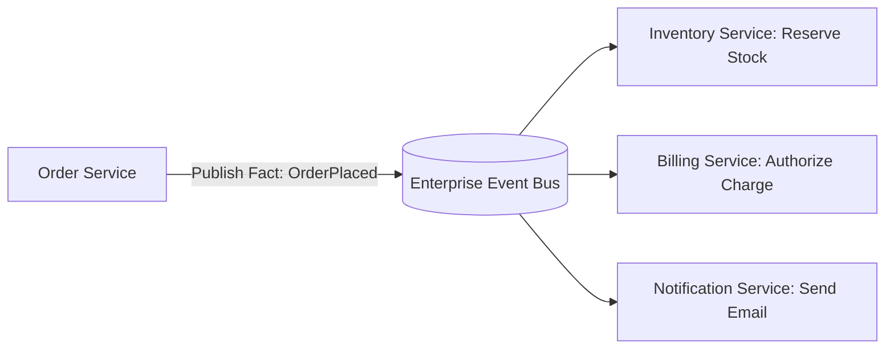

# Event-Driven Architecture: EDA Observability, Distributed Tracing & Correlation IDs

## 1. Architectural Purpose & Problem Context
Tracing asynchronous workflows: injecting OpenTelemetry W3C traceparent headers into message envelopes, visualizing event flows, and lag alerting.

---

## 2. Event-Driven Interaction Model

---

## 3. Production Invariants
- Events must represent past facts (past-tense naming, e.g., `OrderPlaced`, `PaymentFailed`).
- Event consumers must be strictly idempotent.
- Distributed trace contexts must be forwarded across all asynchronous event message envelopes.
