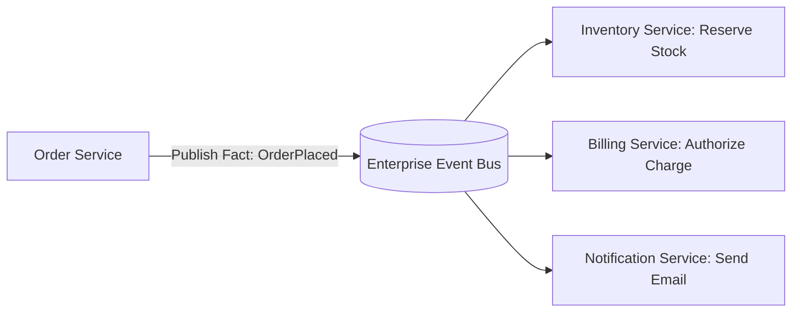

# Event-Driven Architecture: Events vs Commands vs Messages: Core Architectural Taxonomy

## 1. Architectural Purpose & Problem Context
Disambiguating intent: Commands (targeted intent to mutate state), Events (immutable historical fact published to anyone), and Messages (envelope wrapper).

---

## 2. Event-Driven Interaction Model

---

## 3. Production Invariants
- Events must represent past facts (past-tense naming, e.g., `OrderPlaced`, `PaymentFailed`).
- Event consumers must be strictly idempotent.
- Distributed trace contexts must be forwarded across all asynchronous event message envelopes.
