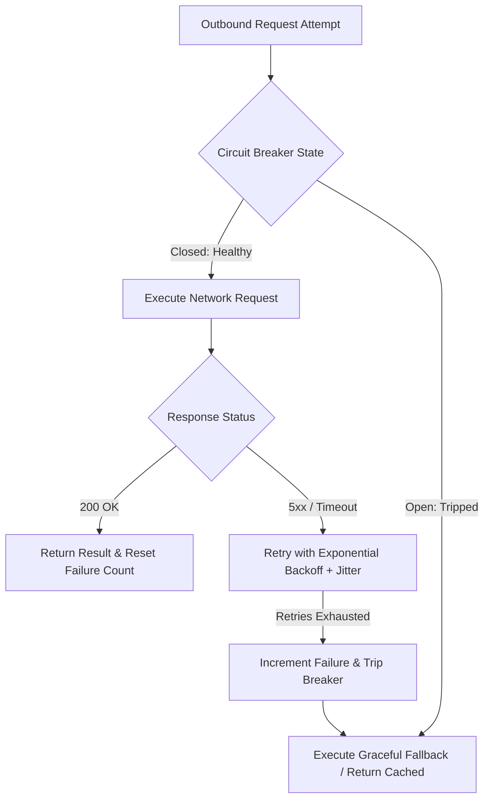

# Integration Failure Engineering & Resiliency Architecture

## 1. Executive Purpose
Designing integration boundaries to survive network partitions, downstream service crashes, cascading retry storms, and data corruption.

---

## 2. Resilient Integration Failure Triage Flow

---

## 3. Production Invariants
- All outbound network calls must have strict connect timeouts (e.g., 2s) and read timeouts (e.g., 5s).
- Retries must always incorporate exponential backoff with full randomized jitter to avoid thundering herds.
- Always implement fallbacks (e.g., stale cache, graceful degradation) when downstream dependencies fail.
