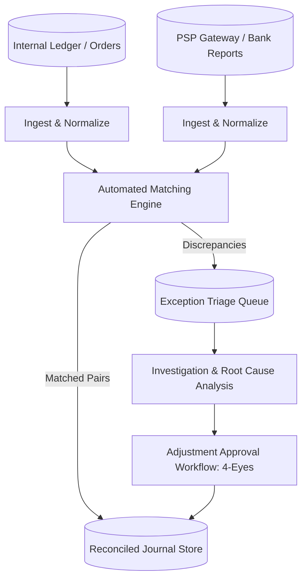

# Reconciliation Architecture: Fee & Tax Reconciliation Architecture

## 1. Architectural Purpose & Problem Context
Validating processor interchange-plus billing against contractual rate cards; identifying overbilled gateway transaction fees.

---

## 2. Reconciliation Engine & Exception Flow

---

## 3. Production Invariants
- Never use fuzzy matching for financial transaction reconciliation; matching must be deterministic and rule-governed.
- All reconciliation exceptions must be tracked in an auditable exception queue with SLA-driven resolution targets.
- Adjustments and ledger write-offs must enforce strict four-eyes authorization controls.
