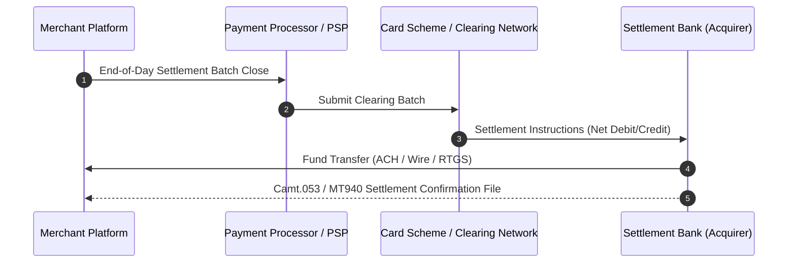

# Settlement Architecture: Settlement Instructions, Files & Bank Protocols

## 1. Architectural Purpose & Problem Context
Interfacing with banking rails: ISO 20022 (pacs.008, camt.053), NACHA files, SWIFT MT103, MT940, and direct banking settlement APIs.

---

## 2. Settlement Lifecycle Flow

---

## 3. Production Invariants
- Always separate clearing (obligation exchange) from settlement (actual money movement).
- Batch files must include strict cryptographic hash verification and batch total amount control sums.
- Settlement failure recovery must maintain clear operational exception queues with automated alerts.
