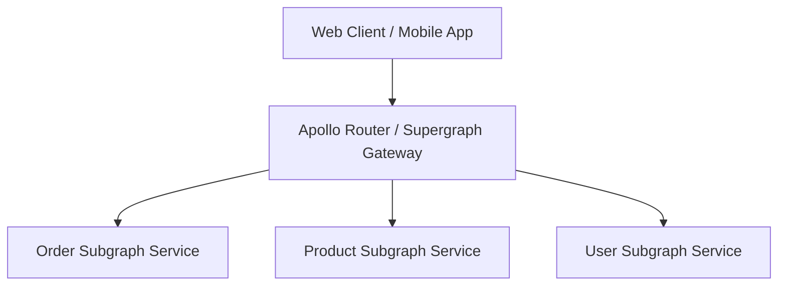

# GraphQL Architecture: DataLoader Architecture & Request-Scoped Batching

## 1. Architectural Purpose & Problem Context
Per-request memoization and batching: collecting entity IDs across the event loop tick and issuing a single `WHERE id IN (...)` query.

---

## 2. GraphQL Federation Topology

---

## 3. Production Invariants
- Disable GraphQL introspection in production to prevent schema harvesting by unauthorized actors.
- Enforce mandatory query depth and complexity score limits on public GraphQL gateways.
- All entity relationship resolvers must utilize DataLoader batching to eliminate N+1 query cascades.
