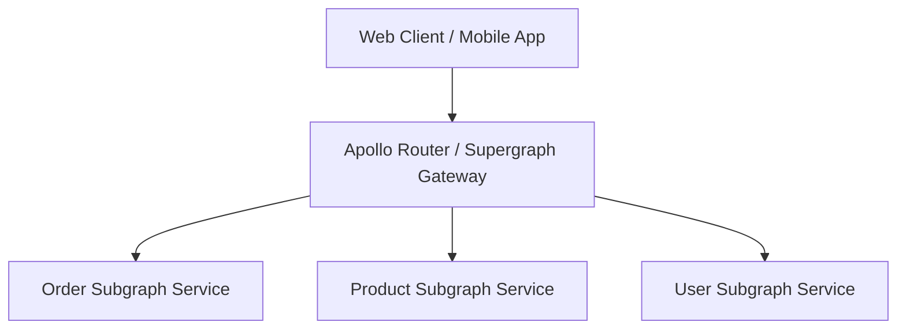

# GraphQL Architecture: GraphQL Schema & Type System Design

## 1. Architectural Purpose & Problem Context
Designing robust GraphQL SDL: scalar types, interfaces, unions, input types, and avoiding anemic entity representations.

---

## 2. GraphQL Federation Topology

---

## 3. Production Invariants
- Disable GraphQL introspection in production to prevent schema harvesting by unauthorized actors.
- Enforce mandatory query depth and complexity score limits on public GraphQL gateways.
- All entity relationship resolvers must utilize DataLoader batching to eliminate N+1 query cascades.
