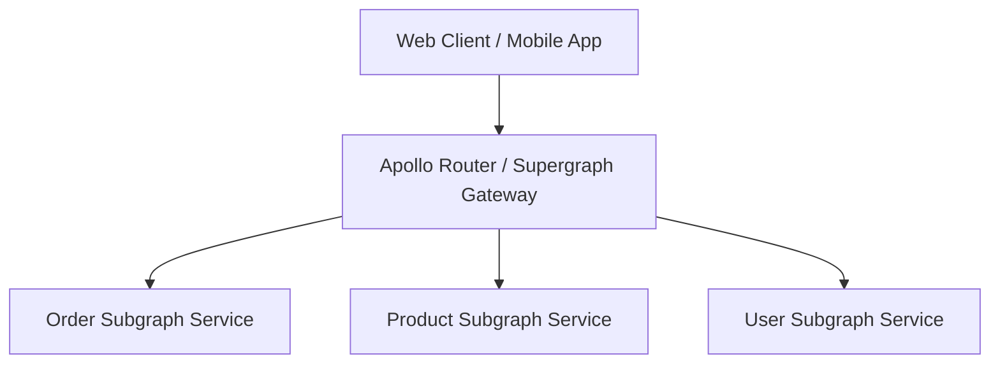

# GraphQL Architecture: GraphQL vs REST Comprehensive Decision Matrix

## 1. Architectural Purpose & Problem Context
Architectural trade-off evaluation: client flexibility vs server complexity, caching friction, payload size, and operational overhead.

---

## 2. GraphQL Federation Topology

---

## 3. Production Invariants
- Disable GraphQL introspection in production to prevent schema harvesting by unauthorized actors.
- Enforce mandatory query depth and complexity score limits on public GraphQL gateways.
- All entity relationship resolvers must utilize DataLoader batching to eliminate N+1 query cascades.
