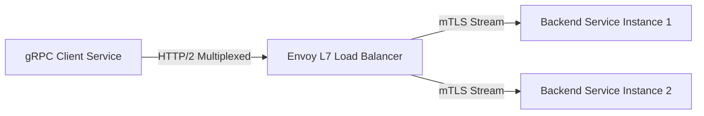

# gRPC Architecture: gRPC Error Handling & Metadata Architecture

## 1. Architectural Purpose & Problem Context
Standard status codes (`INVALID_ARGUMENT`, `UNAVAILABLE`), rich error details with `google.rpc.Status`, and auth headers via metadata.

---

## 2. gRPC Call Lifecycle & Load Balancing Flow

---

## 3. Production Invariants
- Never use L4 (TCP) load balancers for gRPC backends; always use L7 reverse proxies (e.g., Envoy) or client-side round-robin.
- Always attach and propagate gRPC deadlines across all downstream service calls.
- Never change or reuse field numbers in `.proto` files once published to production.
