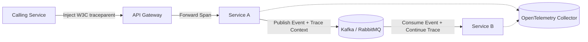

# Enterprise Integration Observability Architecture

## 1. Executive Purpose
Comprehensive observability across asynchronous messaging, synchronous APIs, partner integrations, and financial reconciliation workflows.

---

## 2. Distributed Tracing & Telemetry Topology

---

## 3. Production Invariants
- Every integration request must carry and propagate a W3C `traceparent` and enterprise `correlation_id`.
- Monitor integration health via explicit SLIs/SLOs: P95/P99 latency, HTTP 5xx rate, and DLQ depth.
- Alert immediately on Dead-Letter Queue (DLQ) accumulation or consumer lag exceeding SLA thresholds.
