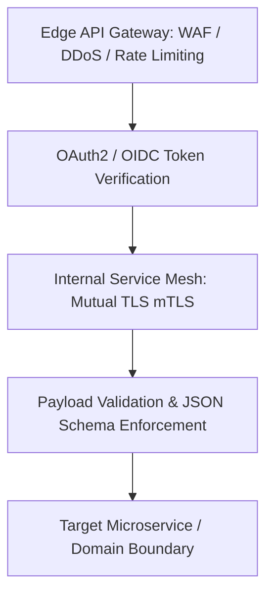

# Enterprise Integration Security Architecture

## 1. Executive Purpose
Securing integration boundaries across internal microservices, partner networks, SaaS providers, and public API consumers.

---

## 2. Zero-Trust Integration Security Layers

---

## 3. Production Invariants
- Mutual TLS (mTLS) is mandatory for all internal service-to-service communication.
- External webhook payloads must be verified using HMAC-SHA256 signatures with secret rotation.
- Store all integration API credentials, certificates, and tokens exclusively in enterprise secret vaults.
