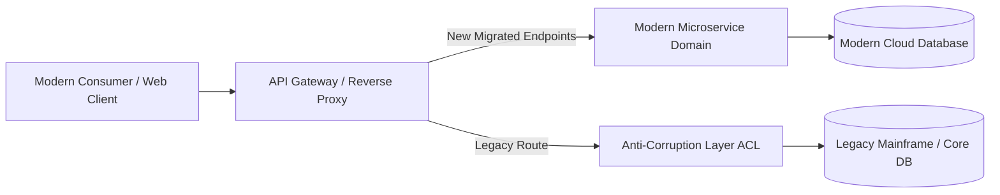

# Legacy Integration: Anti-Corruption Layer (ACL) for Legacy Systems

## 1. Architectural Purpose & Problem Context
Isolating modern domain models from legacy vocabulary: bi-directional mapping, facade adapters, and preventing legacy domain bleeding.

---

## 2. Legacy Strangler & Anti-Corruption Topology

---

## 3. Production Invariants
- Never allow legacy data structures or terminology to permeate modern bounded contexts without an explicit ACL.
- Every legacy migration milestone must be fully reversible with automated fallback capabilities.
