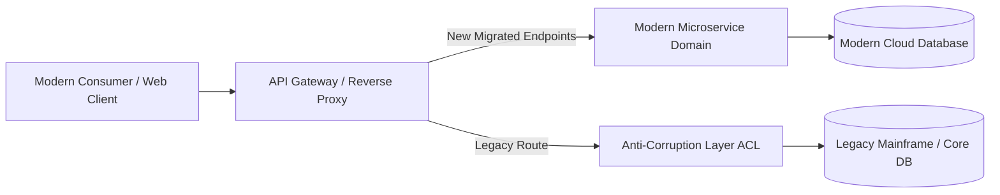

# Legacy Integration: Incremental Modernization & Risk Mitigation

## 1. Architectural Purpose & Problem Context
Mitigating cutover risk: dual-run shadow traffic, automated parity testing, reversible cutover flags, and avoiding catastrophic big-bang replacements.

---

## 2. Legacy Strangler & Anti-Corruption Topology

---

## 3. Production Invariants
- Never allow legacy data structures or terminology to permeate modern bounded contexts without an explicit ACL.
- Every legacy migration milestone must be fully reversible with automated fallback capabilities.
