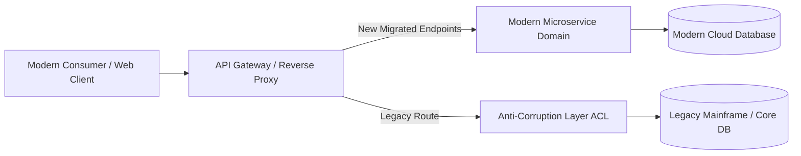

# Legacy Integration: Legacy Databases & Proprietary APIs Integration

## 1. Architectural Purpose & Problem Context
Interfacing with legacy relational databases (DB2, Informix) and RPC APIs; connection management, transaction scope limits, and lock contention avoidance.

---

## 2. Legacy Strangler & Anti-Corruption Topology

---

## 3. Production Invariants
- Never allow legacy data structures or terminology to permeate modern bounded contexts without an explicit ACL.
- Every legacy migration milestone must be fully reversible with automated fallback capabilities.
