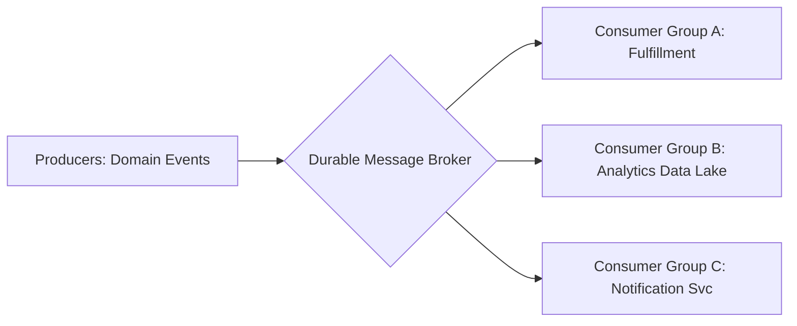

# Messaging & Event-Driven Architecture

## 1. Overview & Architectural Philosophy
Asynchronous messaging is the backbone of decoupled, fault-tolerant, and horizontally scalable enterprise architectures. By replacing tight synchronous RPCs with durable message brokers and distributed event logs, systems eliminate cascading failures, smooth volatile traffic surges, and enable autonomous service evolution.

---

## 2. Broker Models: Smart Broker / Dumb Consumer vs. Dumb Broker / Smart Consumer

| Dimension | Message Queue Paradigm (RabbitMQ / SQS) | Distributed Log Paradigm (Apache Kafka / Pulsar) |
| :--- | :--- | :--- |
| **Model** | Smart Broker, Dumb Consumer | Dumb Broker, Smart Consumer |
| **State Tracking** | Broker tracks message delivery and acknowledgements per message. | Consumer maintains its own reading offset in the log. |
| **Message Retention** | Message deleted immediately upon consumer ACK. | Messages retained durably on disk for days/months; replayable. |
| **Concurrency Model**| Competing consumers pulling from single queue. | Partition-based consumer group parallelism. |
| **Throughput Ceiling**| $10,000\text{--}50,000\text{ msgs/sec}$ | $100,000\text{--}1,000,000+\text{ msgs/sec}$ |

---

## 3. Directory Structure
* [Message Brokers Overview](message-brokers.md)
* [Publish-Subscribe Pattern](publish-subscribe.md)
* [Point-to-Point Pattern](point-to-point.md)
* [Message Queues](message-queues.md)
* [Event Streaming](event-streaming.md)
* [Kafka Architecture](kafka-architecture.md)
* [RabbitMQ Architecture](rabbitmq-architecture.md)
* [Ordering Guarantees](ordering-guarantees.md)
* [Delivery Guarantees](delivery-guarantees.md)
* [At-Least-Once Delivery](at-least-once.md)
* [At-Most-Once Delivery](at-most-once.md)
* [Exactly-Once Semantics](exactly-once.md)
* [Idempotent Consumer Pattern](idempotent-consumer.md)
* [Dead Letter Exchange (DLX)](dead-letter-exchange.md)
* [Log Compaction](compaction.md)
* [Partitioning Strategy](partitioning.md)
* [Consumer Groups](consumer-groups.md)
* [Backpressure in Messaging](backpressure.md)
* [Event Filtering](event-filtering.md)
* [Schema Registry](schema-registry.md)
* [Change Data Capture (CDC)](cdc.md)
* [Debezium Architecture](debezium.md)
