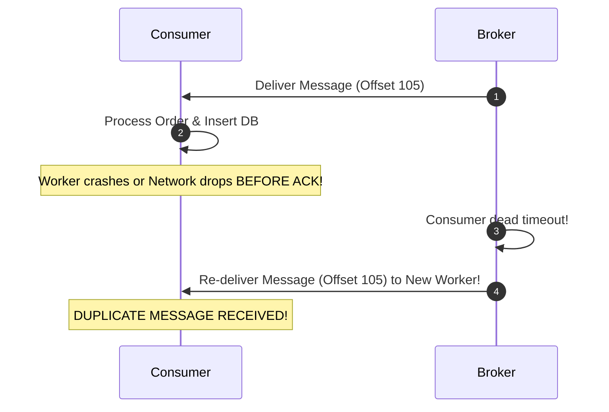

# At-Least-Once Delivery Architecture

## 1. Why At-Least-Once Is the Industry Baseline
At-Least-Once delivery guarantees that no message is ever lost, accepting that transient network retries may cause duplicate processing:
* **Producer**: Retries transmission with exponential backoff until the broker issues a durable persistence acknowledgment.
* **Consumer**: Fetches message, processes business logic, and commits the offset / ACK **only after successful local completion**.

---

## 2. Mandatory Architectural Pairing
**At-Least-Once delivery MUST be paired with an Idempotent Consumer**. Delivering messages without duplicate processing safety creates severe billing and inventory corruption.
