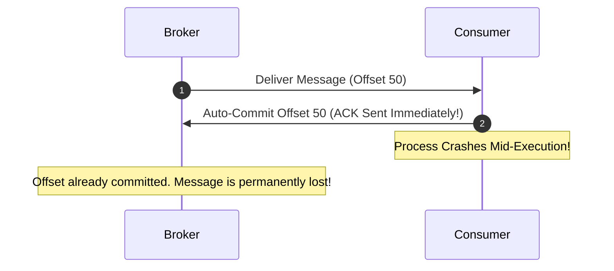

# At-Most-Once Delivery Architecture

## 1. Mechanics of "Fire-and-Forget"
At-Most-Once guarantees that a message will be processed at most once. If a crash or network partition occurs, the message is discarded:
* **Producer**: Sends message with `acks=0`. Does not wait for broker response.
* **Consumer**: Commits the message offset or sends AMQP `ACK` **immediately upon receipt**, *before* executing business logic.

---

## 2. Legitimate Production Use Cases
* High-frequency telemetry (e.g., GPS vehicle tracking every 500ms; missing 1 ping is harmless).
* Real-time metrics and APM tracing data where memory backpressure requires shedding.
