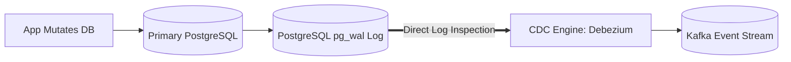

# Change Data Capture (CDC) Architecture

## 1. Principles of Change Data Capture
Change Data Capture (CDC) captures row-level mutations (`INSERT`, `UPDATE`, `DELETE`) from a database's low-level transaction log (Write-Ahead Log) and streams them in real-time as an ordered event feed.

---

## 2. Why CDC Trumps Database Polling

| Dimension | Database Polling (`SELECT ... WHERE updated_at > T`) | Transaction-Log CDC (Debezium) |
| :--- | :--- | :--- |
| **Performance Overhead** | Heavy: Continuous table scans and lock contention. | Near Zero: Reads sequential disk WAL asynchronously. |
| **Latency** | Polling interval (e.g., 30s to 5 mins). | Sub-second ($<50\text{ ms}$). |
| **Hard Delete Capture** | Cannot capture `DELETE` (the row is gone!). | Perfectly captures row deletion events. |
| **Event Loss Risk** | Multiple updates between poll cycles are lost. | Every intermediate state change is captured. |
