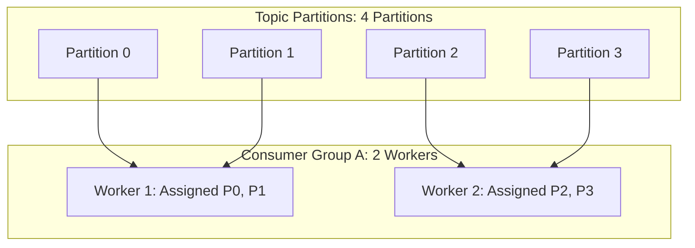

# Consumer Groups & Rebalance Protocols

## 1. Partition Assignment & Scalability Bounds
A **Consumer Group** coordinates multiple worker instances to divide the partitions of a topic.
* **The Maximum Parallelism Rule**: A single partition can be assigned to **at most one consumer instance** within the same consumer group.
* If a topic has **8 partitions**, deploying **12 consumer pods** leaves **4 pods completely idle** ($12 - 8 = 4$).

---

## 2. Rebalance Protocols: Eager vs. Cooperative Sticky
* **Eager Rebalance (Legacy)**: When a worker joins or dies, all consumers stop processing, revoke all partitions, and re-join (**Stop-the-World pause** for the entire group).
* **Cooperative Sticky Rebalance (Modern Kafka)**: Only migrates the specific partitions that need to be rebalanced, allowing remaining consumers to continue uninterrupted stream processing.
