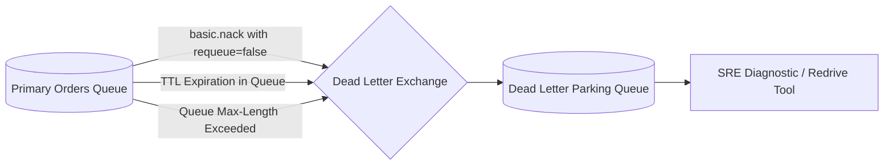

# Dead Letter Exchange (DLX) Architecture

## 1. Routing Poison & Expired Messages
In RabbitMQ, a **Dead Letter Exchange (DLX)** is an exchange to which messages are automatically routed when they cannot be delivered or processed in their primary queue.



---

## 2. Configuration Directives (RabbitMQ)
```json
{
  "x-dead-letter-exchange": "orders.dlx",
  "x-dead-letter-routing-key": "orders.poison",
  "x-message-ttl": 86400000
}
```
* Messages rejected with `basic.reject(requeue=false)` bypass the main queue and are preserved durably in the dead letter parking lot.
