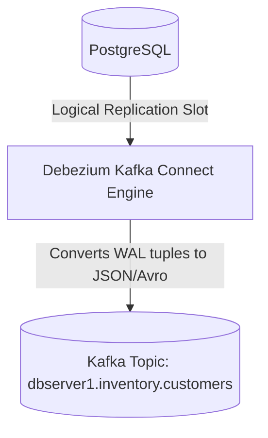

# Debezium Architecture & Implementation

## 1. The Distributed CDC Standard
Built as a Kafka Connect source connector, **Debezium** tail-reads database transaction logs across PostgreSQL (`pgoutput`), MySQL (`binlog`), MongoDB (`oplog`), and SQL Server.



---

## 2. Debezium Event Envelope Structure
Every CDC event contains comprehensive metadata:
```json
{
  "before": { "id": 1001, "status": "PENDING" },
  "after":  { "id": 1001, "status": "SHIPPED" },
  "source": {
    "version": "2.4.0",
    "connector": "postgresql",
    "ts_ms": 1725508800000,
    "lsn": 2490184
  },
  "op": "u"
}
```
* `op`: `c` (Create/Insert), `u` (Update), `d` (Delete), `r` (Initial Snapshot Read).
