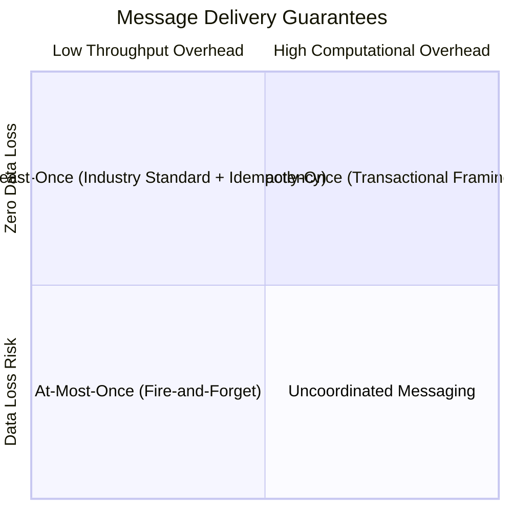

# Message Delivery Guarantees

## 1. The Three Delivery Semantics

| Guarantee | Protocol Behavior | Failure Outcome | Production Fit |
| :--- | :--- | :--- | :--- |
| **At-Most-Once** | ACK before processing; no retries. | Messages may be permanently lost. | High-frequency sensor pings. |
| **At-Least-Once** | Process then ACK; producer retries. | Messages never lost, but duplicates occur. | Core enterprise transactions. |
| **Exactly-Once** | Atomic producer-broker-consumer transactions. | Exactly one state mutation occurs. | Financial ledger balance transfers. |
