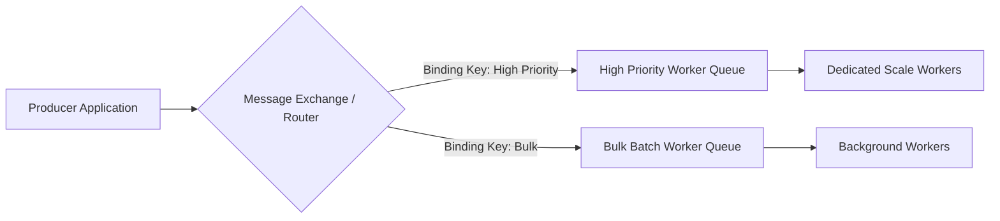

# Enterprise Messaging Architectures & Integration Patterns

## 1. Overview
Enterprise messaging decouples distributed subsystems across time, space, and technology stacks using standardized message constructs: Queues, Topics, Exchanges, Channels, and Routers.

---

## 2. Core Messaging Patterns

---

## 3. Production Invariants & Best Practices
- Define clear message ownership and explicit message contracts (JSON Schema or Protobuf).
- Configure Dead-Letter Queues (DLQ) with alert thresholds on every production queue.
- Implement consumer rate limiting to prevent overwhelming downstream legacy databases during queue backlog draining.
