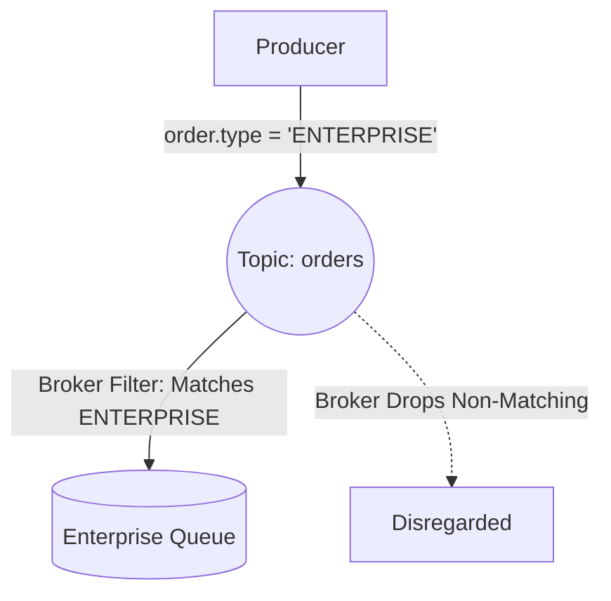

# Event Filtering & Server-Side Routing

## 1. Edge Filtering vs. Consumer-Side Filtering
* **Consumer-Side Filtering (Anti-Pattern)**: The consumer pulls $100\%$ of all events across the network and discards $99\%$ in application code. Massive bandwidth and CPU waste.
* **Server-Side Filtering**: The broker inspects metadata or headers and routes only matching events to the consumer.



---

## 2. Implementation Paradigms
1. **AMQP Topic Exchanges**: Wildcard routing keys (e.g., `eu.orders.created`).
2. **AWS SNS Filter Policies**: JSON attribute matching at the cloud edge:
   ```json
   { "tier": ["enterprise", "vip"], "amount": [{ "numeric": [">=", 1000] }] }
   ```
3. **Kafka Streams / ksqlDB**: Stream filtering directly on the distributed log before emitting to output topics.
