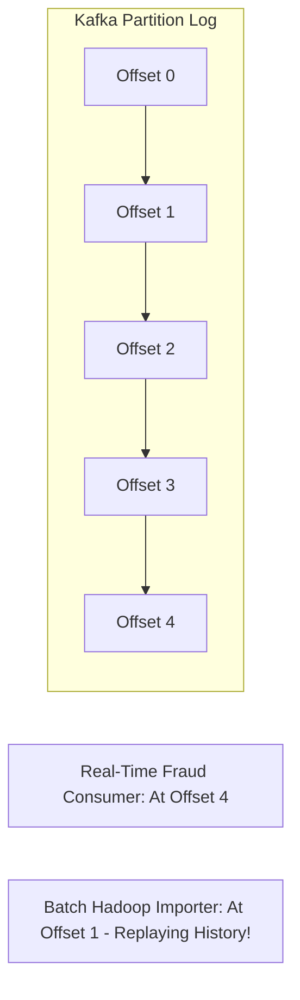

# Event Streaming & Distributed Logs

## 1. The Append-Only Commit Log
Unlike traditional message queues, **Event Streaming platforms (Apache Kafka, Apache Pulsar)** treat events as an immutable, ordered, append-only log persisted durably on disk.

---

## 2. Architectural Distinctions of Event Streams
* **Durability & Replayability**: Events are not deleted upon consumption. Consumers can reset their offset to timestamp $T_0$ and replay years of historical business events.
* **Extreme Throughput**: Employs sequential disk writes and Linux kernel `sendfile` zero-copy network transfer, sustaining gigabytes per second per broker.
