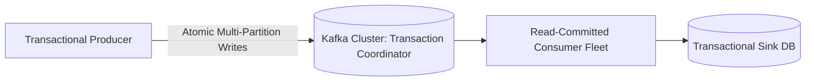

# Exactly-Once Semantics (EOS)

## 1. Demystifying Exactly-Once
In physical networking, sending a packet over an unreliable network "exactly once" is physically impossible. When distributed streaming platforms advertise **Exactly-Once Semantics (EOS)**, they mean **Effectively-Once Processing**: the end-to-end state change across the producer, broker, and consumer is identical to a hypothetical system where duplicates never occurred.

---

## 2. Kafka Exactly-Once Architecture
1. **Idempotent Producer**:
   * The broker assigns a **Producer ID (PID)**.
   * Every message carries a monotonically increasing **Sequence Number** per partition.
   * Broker discards any message whose sequence number is $\le$ the highest sequence number committed for that PID.
2. **Transactional Coordinator**:
   * Coordinates atomic writes spanning multiple topics and partition offsets via a lightweight Two-Phase Commit protocol written to the internal `__transaction_state` topic.
3. **Consumer Isolation**:
   * Downstream consumers configured with `isolation.level = read_committed` filter out uncommitted and aborted transactional messages.
