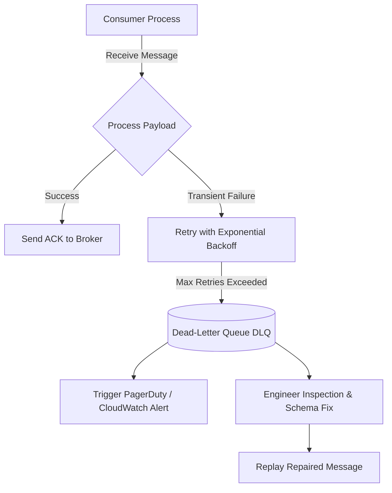

# Guaranteed Delivery & Dead-Letter Queue (DLQ) Governance

## 1. Overview
Guaranteed delivery ensures messages persist across broker crashes and network partitions until explicitly processed, while Dead-Letter Queues (DLQs) isolate poison messages to prevent pipeline blockage.

---

## 2. Poison Message Triage Workflow

---

## 3. Production Invariants
- Never discard poison messages silently; route them to an auditable DLQ with full error context headers.
- Implement exponential backoff with jitter on retries to avoid broker saturation.
- Provide automated tooling to inspect, modify, and replay messages from the DLQ.
