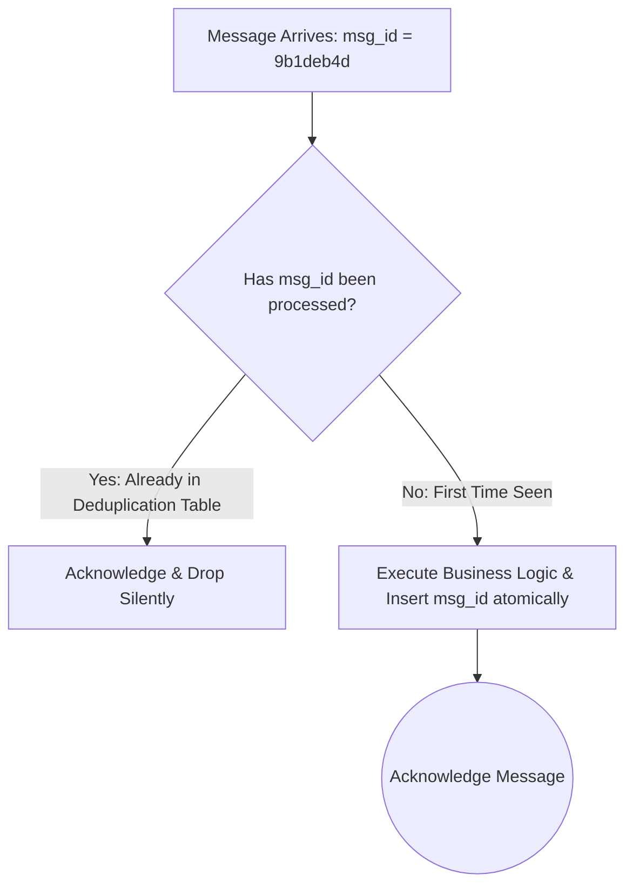

# Idempotent Consumer Pattern

## 1. Principles of Idempotent Consumption
Because networks drop acknowledgments, consumers operating under At-Least-Once delivery inevitably receive duplicate messages. An **Idempotent Consumer** guarantees that processing a duplicate payload produces zero additional side effects.



---

## 2. Deduplication Implementations

### 1. Database Unique Constraint
Within the same local SQL transaction that mutates business tables:
```sql
INSERT INTO processed_messages (message_id, processed_at) VALUES ('9b1deb4d', NOW());
```
If a duplicate message arrives, the database throws a unique constraint violation (`DuplicateKeyException`), allowing the worker to safely acknowledge and discard the message.

### 2. Natural Idempotency
Design mutations such that repeating them does not alter final state:
* *Non-Idempotent*: `UPDATE accounts SET balance = balance - 100` (Repeating drains money!).
* *Naturally Idempotent*: `UPDATE accounts SET balance = 500, version = 2 WHERE version = 1`.
