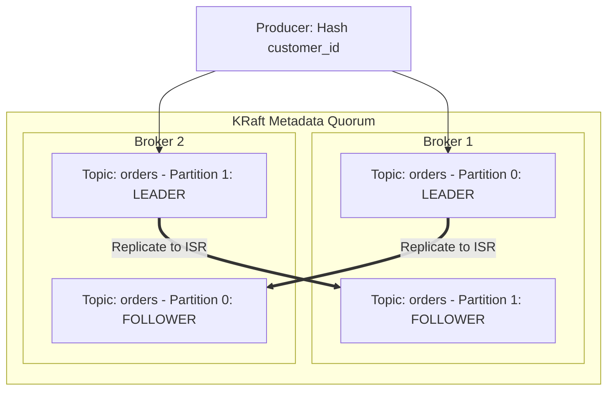

# Apache Kafka Architecture

## 1. Topography of the Distributed Commit Log
Apache Kafka is a distributed, partitioned, replicated commit log service designed for high-throughput stream ingestion.

---

## 2. The Mechanics of Zero-Copy Performance
In traditional I/O, reading data from disk and sending it over a network socket incurs **4 context switches and 4 memory copies** through kernel and user-space buffers.
* **Kafka Zero-Copy (`sendfile` Linux Syscall)**:
  $$\text{Disk File} \xrightarrow{\text{DMA}} \text{OS Page Cache} \xrightarrow{\text{DMA}} \text{Network Interface Card (NIC)}$$
* Data is copied directly by DMA (Direct Memory Access) from the kernel page cache to the NIC buffer without entering CPU application memory.

---

## 3. Producer Durability Guarantees (`acks`)
* `acks=0`: Fire-and-forget. Maximum throughput, zero durability.
* `acks=1`: Acknowledged once the partition Leader flushes to local log.
* `acks=all` (with `min.insync.replicas=2`): Acknowledged only when all In-Sync Replicas (ISR) have written to disk. **Zero data loss under leader crashes**.
