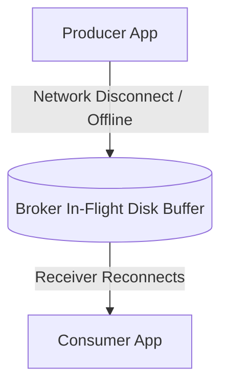

# Message Brokers Architecture

## 1. Defining the Message Broker
A message broker is an intermediary software module that translates, routes, buffers, and persists messages between distributed communicating services, decoupling senders from receivers in both time and space.

---

## 2. Core Broker Responsibilities
* **Temporal Decoupling**: Producer and consumer do not need to run concurrently.
* **Protocol Translation**: Translating between AMQP, MQTT, STOMP, Kafka protocol, and HTTP.
* **Routing & Exchange Logic**: Direct, Topic, Fanout, and Header-based routing.
* **Durability & Buffering**: Absorbing write bursts on disk without dropping transactions.
